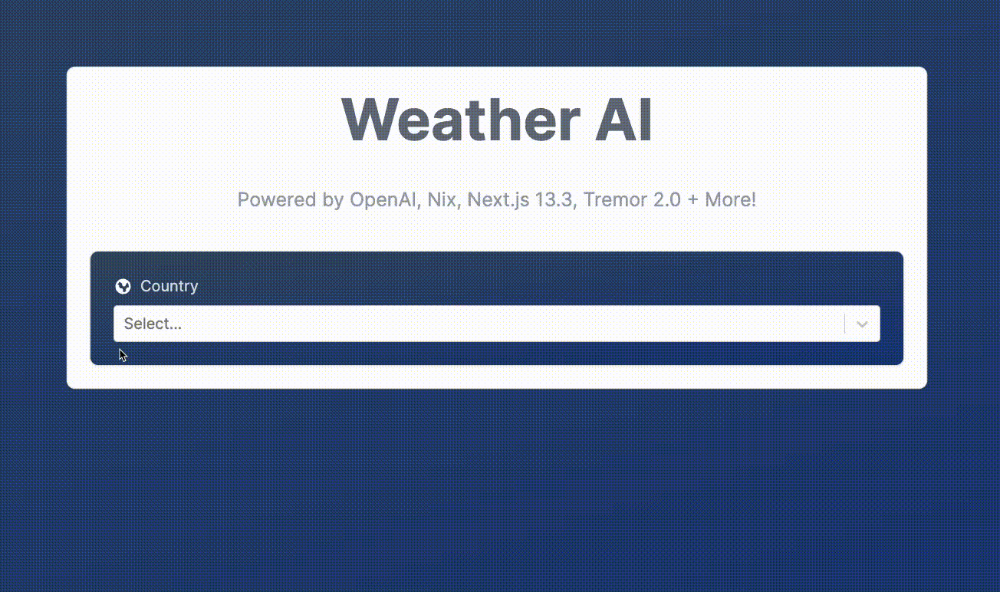
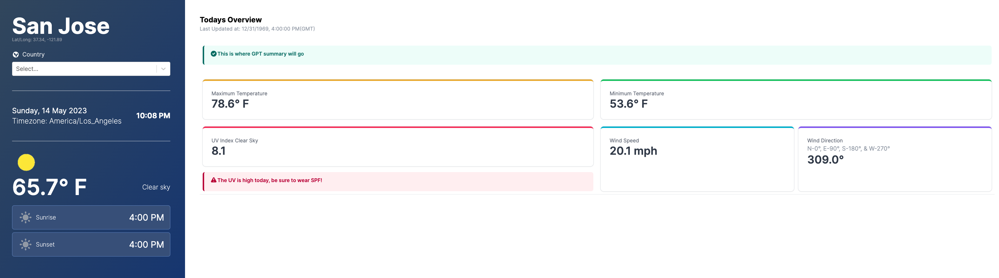

# StepZen Weather AI App

A Stepzen Weather AI App using the chatGPT API.
*Development in-process.*


<!-- This project is built using [Nix](https://nixos.org/) package manager; spcifically [Nix Flakes](https://nixos.wiki/wiki/Flakes) for a reliable, reproducible build by adding a lock file concept to the project. This is a [Next.js](https://nextjs.org/) project. -->
## Getting Started

### Frontend
First, run the development server:

```bash
start-frontend
```

Open [http://localhost:3000](http://localhost:3000) with your browser to see the result.
### Backend

```bash
start-stepzen
```

Open the `localhost:5001` with your browser to see the result.

## Walkthrough
The landing page will have an seletion for `Country`, (optionally `State`), and `City`.


<p style="text-align: center;">Landing Page</p>

Once the city of choice has been selected, the request is posted and the client will be directed to a page with the corresponding city weather information (e.g. example shown below).


<p style="text-align: center;">Selected City</p>

<!--
## Learn More
TBA -->

### Development:
- [Nix](https://nixos.org/) package manager - [Nix Flakes](https://nixos.wiki/wiki/Flakes)
- [Next.js](https://nextjs.org/)
- [TypeScript](https://www.typescriptlang.org/)
- [StepZen](https://stepzen.com/) is a GraphQL server with a unique architecture.
- [Free Weather API](https://open-meteo.com/)
- [Weather API Icons](https://www.weatherbit.io/)
- [Tremor](https://www.tremor.so/) for stylized components
- [Tailwind CSS](https://tailwindcss.com/)
